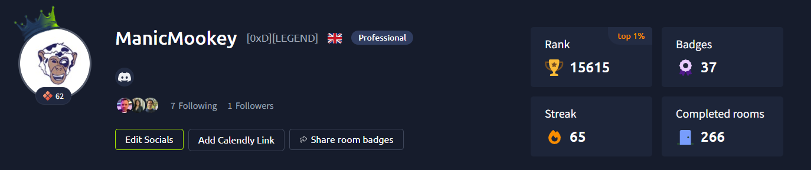
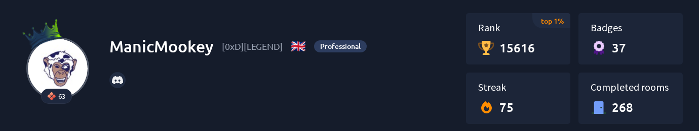

<h1 align="center">Hi, I'm Michael 👋</h1>

Network Engineer transitioning into Cybersecurity | Aiming for SOC Tier 1 Analyst

## TryHackMe Progress

[View my TryHackMe profile](https://tryhackme.com/p/ManicMookey)

About Me

I'm an Assistant Network Engineer specialising in hardware configuration for cabinet deployment, with hands-on experience building networks from scratch (RADIUS server setup, segmentation, traffic monitoring). That networking foundation has pulled me toward cybersecurity — I'm now building detection and analysis skills with Wireshark, Suricata, Zeek, and Sentinel/Splunk, working toward a Security Operations Center (SOC) Tier 1 Analyst role.

Currently documenting a full home network security build — segmentation, monitoring, and detection — as my next hands-on project.

🔭 Currently Building

Home Network Security Project — designing and documenting a segmented home lab with traffic monitoring and detection. (Coming soon)

Skills & Projects

SkillProjectBuilding a network from scratch, incl. RADIUS server setupNetwork SetupIntro to ethical hacking fundamentalsGetting Started Becoming a Master Hacker (notes)

A few rows from the old table (Wireshark labs, GNS3 lab, Hack The Box, OSINT training) didn't have real repos behind them yet — I've left them out for now rather than link to placeholders. Send me the actual repo/write-up links (or say the word) and I'll slot them back in.

## TryHackMe Progress

[View my TryHackMe profile](https://tryhackme.com/p/ManicMookey)

Tools

Network

Endpoint

SIEM

Certifications

✅ Completed

🔄 In Progress

🎯 Committed To

<b>Other Certifications</b> (field/telecoms background — click to expand)

 

Projects

🏠 Home Network Security Project — coming soon
📘 Getting Started Becoming a Master Hacker (notes)
🔧 Basic Network Setup (RADIUS server)
🤖 SOC Automation Project (link needed — is this repo live yet?)
